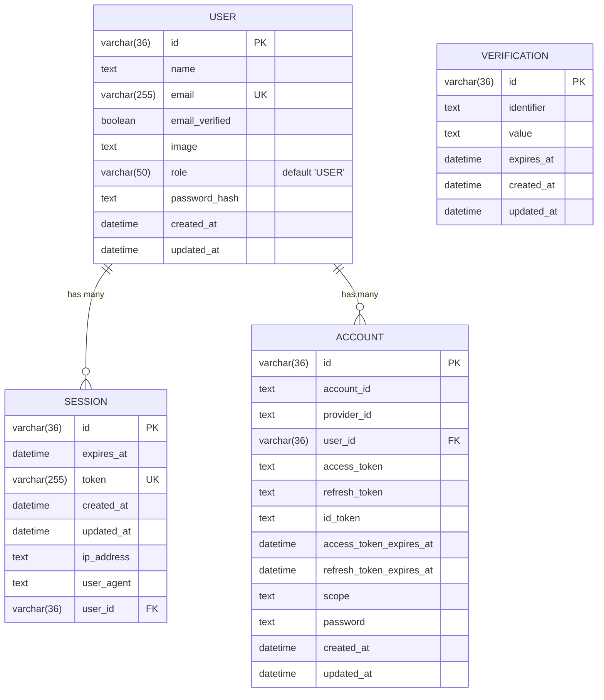

# Entity-Relationship Diagram (ERD)

This document contains the Entity-Relationship Diagram (ERD) and table details for the Kilex Hono database schema.

---

## 📊 ER Diagram (Mermaid)

---

## 🗃️ Table Specifications

### 1. `user` Table
Stores basic information for registered users. Handles both custom credential registrations and social OAuth logins.
*   `id`: Primary Key (UUID length 36).
*   `name`: Plain text name.
*   `email`: Email address (unique, indexed).
*   `emailVerified`: Boolean flag to check verified status.
*   `image`: URL string pointing to avatar images (usually populated via Google login).
*   `role`: User authorization level (`ADMIN` or `USER`). Default is `USER`.
*   `passwordHash`: Scrypt-hashed password (used only for custom email/password auth).
*   `createdAt`: Timestamp of registration.
*   `updatedAt`: Timestamp of last edit.

---

### 2. `session` Table
Tracks active Better Auth cookie sessions.
*   `id`: Primary Key.
*   `expiresAt`: Expiry date of the session.
*   `token`: Unique lookup token.
*   `createdAt` & `updatedAt`: Timestamps.
*   `ipAddress` & `userAgent`: Client metadata.
*   `userId`: Foreign Key referencing `user.id`. Configured with **`ON DELETE CASCADE`** so sessions clear automatically if a user is deleted.

---

### 3. `account` Table
Stores linked credential providers (e.g. `google`, `credentials`, etc.) for users.
*   `id`: Primary key.
*   `accountId`: External account ID provided by the OAuth provider.
*   `providerId`: The provider name (e.g. `'google'`, `'github'`).
*   `userId`: Foreign Key referencing `user.id` (`ON DELETE CASCADE`).
*   `accessToken`, `refreshToken`, `idToken`: Token values returned by OAuth provider.
*   `accessTokenExpiresAt`, `refreshTokenExpiresAt`: Token expiry timestamps.
*   `scope`: Authorized API scopes.
*   `password`: Hashed credentials password (managed by Better Auth email/password module, separate from our custom `user.passwordHash`).

---

### 4. `verification` Table
Manages temporary keys used during authentication tasks (like email verifications and password resets).
*   `id`: Primary Key.
*   `identifier`: Lookup identity (e.g. email or username).
*   `value`: Hashed token value.
*   `expiresAt`: Time when the token expires.
